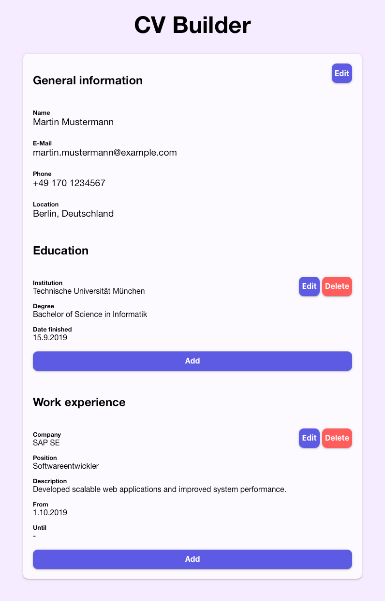

# CV Builder

<p align="center">
  
  <a href="https://github.com/insomniac2305/cv-builder/graphs/commit-activity" target="_blank"></a>
  
  <a href="https://github.com/insomniac2305/cv-builder/blob/master/LICENSE" target="_blank"></a>
</p>

## Overview

A simple and interactive CV builder built with React. This project allows users to input and manage their personal details, education, and work experience to create a structured resume.
It was built to practice React as part of [The Odin Project's curriculum](https://www.theodinproject.com)

<p align="center">
  
</p>

## Features

- ✍️ Add, modify and delete CV details
- ⚡️ Reactive UI

## Technologies Used

- React (Create React App)
- Plain CSS

## Setup Instructions

1. Clone the repository:
   ```sh
   git clone https://github.com/insomniac2305/cv-builder.git
   cd cv-builder
   ```
2. Install dependencies:
   ```sh
   npm install
   ```
3. Start the development server:
   ```sh
   npm start
   ```
4. Open your browser and navigate to:
   ```
   http://localhost:3000
   ```

## Build & Deployment

To create an optimized build for production, run:

```sh
npm run build
```

This project is configured for deployment via GitHub Pages:

```sh
npm run deploy
```

Enjoy building your CV! 🎉

## License

This project is [GPL-3.0](https://github.com/insomniac2305/cv-builder/blob/master/LICENSE) licensed.
